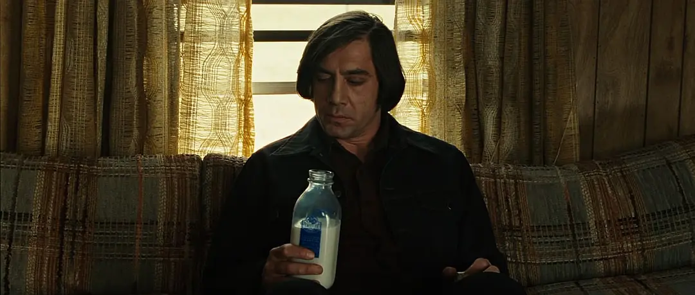

import { themes, Head, Notes } from 'mdx-deck'

export const theme = themes.dark

<Head>
  <title>No Country for Old Men</title>
</Head>

# No Country for Old Men

Cormac McCarthy

---

# The Story

---

---

---

---

---

## 👨🏽💧

---

## 🌲☠️👝
### 💵 * 2400000

---

## 🛏️💧

---

## 🚗💧☠️

---

---

---

---

---

## 🏨😨

---

---

---

---

---

## 🌿👝😵

---

---

---

> This man wont stop looking for you. Even if he gets the money back. It wont make any difference to him. Even if you went to him and gave him the money he would still kill you. Just for having inconvenienced him.

---

> There's no one alive on this planet that's ever had even a cross word with him. They're all dead. These are not good odds. He's a peculiar man. You could even say that he has principles. Principles that transcend money or drugs or anything like that.

---

## 🏨👨🔫🧑🏻

---

> If the rule you follow led you to this of what use was the rule?
>
> I am talking about your life. In which now everything can be seen at once.
>
> You think I'm like you. That it's just greed. But I'm not like you. I live a simple life.

---

---

---

## 👨👩🔫👨🏽👨🏽👨🏽

---

---

## 👩🔫

---

---

---

---

---

> This country is hard on people. But they never seemed to hold it into account.
> 
> The country will kill you in a heartbeat and still people love it.

---

## 👨💰

---

## ⛰️🔥🏇🏇

> it was like we was both back in older times and I was on horseback goin through the mountains of a night... It was cold and there was snow on the ground and he rode past me and kept on goin. Never said nothin. He just rode on past and he had this blanket wrapped around him and he had his head down and when he rode past I seen he was carryin fire in a horn the way people used to do and I could see the horn from the light inside of it. About the color of the moon. And in the dream I knew that he was goin on ahead and that he was fixin to make afire somewhere out there in all that dark and all that cold and I knew that whenever I got there he would be there. And then I woke up.

---

# Characters

---

## Llewelyn Moss 👝

---

* 越战老兵，神枪手
* 自信、独立
* 奈何有软肋
  * 💧道德、良心: I'm fixin to go do somethin dumbern hell but I'm goin anyways. If I dont come back tell Mother I love her.
  * 🔫Carla Jean:

---

## Anton Chigurh 🔫

---

---

> psychopathic killer

---

### 武器

* Captive Bolt Pistol
* silenced semi-automatic shotgun

---

* 视人命如草芥
* 智商在线有原则
* 坚韧

---

## Ed Tom Bell 👮

* 警察世家
* 二战老兵
* 阴影：当年没保护战友独自逃脱回来却成了英雄

---

### 面对罪恶无所适从

* 为什么那对加利福尼亚夫妻杀老人之前还要折磨他们？
* 为什么母亲会杀自己的孩子？
* Chigurh为什么会干这种事？

---

### 一厢情愿得认为过去是太平的,被叔叔打脸

* 有的警察一辈子都没有配枪
* 二战时少年的问题是抄作业、上课说话、嚼口香糖，现在……
* 过去哪里需要🚓啊

---

### God

---

# 对战争的反思

---

## Bell & Moss 父亲: 二战

* Bell因获得战斗英雄后半生都活在愧疚之中

---

## Moss & Wells: 越战

* 越战的非正义性对美国人民心中的负面影响巨大，引发大规模反战浪潮 👉 嬉皮士

---

### 小警察描述毒品交易现场

> It must of sounded like Vietnam out there.

---

### Moss 父亲的话

> when he come home he went to visit several families of buddies of his that had not made it back. He give it up. He didnt know what to say to em. He said he could see em settin there lookin at him and wishin he was dead.

---

> We didnt have nothin like that in the war. Or very little of it. He smacked the tar out of one or two of them hippies. Spittin on him. Callin him a babykiller. A lot of them boys that come back, they're still havin problems. I thought it was because they didnt have the country behind em. But I think it might be worse than that even. The country they did have was in pieces. It still is. It wasnt the hippies' fault. It wasnt the fault of them boys that got sent over there neither. Eighteen, nineteen year old.

---

> People will tell you it was Vietnam brought this country to its knees. But I never believed that. It was already in bad shape. Vietnam was just the icin on the cake. We didnt have nothin to give to em to take over there. If we'd sent em without rifles I dont know as they'd of been all that much worse off. You cant go to war like that. You cant go to war without God. I dont know what is goin to happen when the next one comes. I surely dont.

---

# 对恶的理解

---

# Fate

---

Moss: 以为能靠自己的本事求生……

Bell: 没能保护Moss和Carla Jean

---

## Chigurh vs 商店老板: 硬币不止是硬币

> What's the most you ever lost in a coin toss?

---

> Yes you did. You've been putting it up your whole life. You just didnt know it. You know what the date is on this coin?
>
> It's nineteen fifty-eight. It's been traveling twenty-two years to get here. And now it's here. And I'm here. And I've got my hand over it. And it's either heads or tails. And you have to say. Call it.
> 
> You stand to win everything, Chigurh said. Everything.

---

> Anything can be an instrument, Chigurh said. Small things. Things you wouldnt even notice. They pass from hand to hand. People dont pay attention. And then one day there's an accounting. And after that nothing is the same. Well, you say. It's just a coin. For instance. Nothing special there. What could that be an instrument of? You see the problem. To separate the act from the thing. As if the parts of some moment in history might be interchangeable with the parts of some other moment. How could that be? Well, it's just a coin. Yes. That's true. Is it?

---

## Chigurh vs Wells 

> If the rule you followed brought you to this, of what use was the rule?

---

## Chigurh vs Carla Jean

---

# 👋❤️

---

# Reference

<https://www.litcharts.com/lit/no-country-for-old-men>

电影剧本 <www.raindance.co.uk/site/picture/upload/image/scripts/No_Country%20_(Shooting).pdf>
